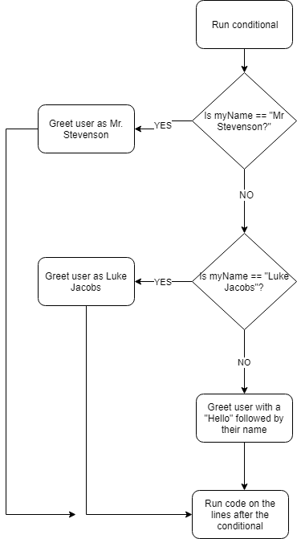

# What are conditionals?

Conditionals are blocks of code that only run if a certain condition is true. 

# Conditional Format

```python
if condition:
	do
	something
	if condition is true
elif condition2:
	do
	something
	if condition2 is true
[you can insert some more elif blocks here]
else:
	do something
	if neither condition is true
```

Conditionals ALWAYS have at least an `if`, a condition that follows, a colon, and an indented block of code that follows on the next lines. Conditionals can have an unlimited amount of `elif` blocks. `elif` stands for `else if`, which means if the previous condition was `False`, test this condition. Finally, you can add an optional `else` block which runs its indented code section if ALL of the previous conditions were false. I'm sure you did not absorb all of that, so let's look at a specific example!

# Specific Examples

You will almost always use comparison operators and logical operators to build conditions. 

```python
myName = "Caillou"
myAge = 21

if myName == "Mr Stevenson":
	print "Hello monk!"
elif myName == "Luke Jacobs":
	print "Hello teacher/scholar/genius!"
else:
	print "Hello " + myName #this combines the two strings into one
```

This example greets someone based on their name. If the person's name is "Mr Stevenson" or "Luke Jacobs", it greets that person in a special way. If the person has any other name, the program will greet them with simply a "Hello" followed by a space and then their name. Let's look at the flow of this program. This program makes two comparisons and responds in a different way depending on what the value of `myName` is. The first two lines are simple because it's just 2 variable initializations. When the program gets to the `if`, it has two forks in the road that it can go down. Either it can greet them as Mr. Stevenson, or it can just keep going. In this case, it will just keep going because `myName == "Mr Stevenson"` is `False`. If that condition was true, then it would run the indented code section and skip to the end of the conditional. So now our program is at the `elif`. Our program has another fork in the road. Either it can greet the user as Luke Jacobs or it can move on. `myName == "Luke Jacobs"` is false, so the program moves on through the conditional. It comes to the end of the condition which is an `else` block. An `else` block is ALWAYS run if the program gets to that point in the conditional. This means that if `myName == "Mr Stevenson"` AND `myName == "Luke Jacobs"` were BOTH `False`, then the `else` block would run. It essentially tells the program to do something if every other test before it is `False`. I hope this flowchart helps you visualize what is going on:




