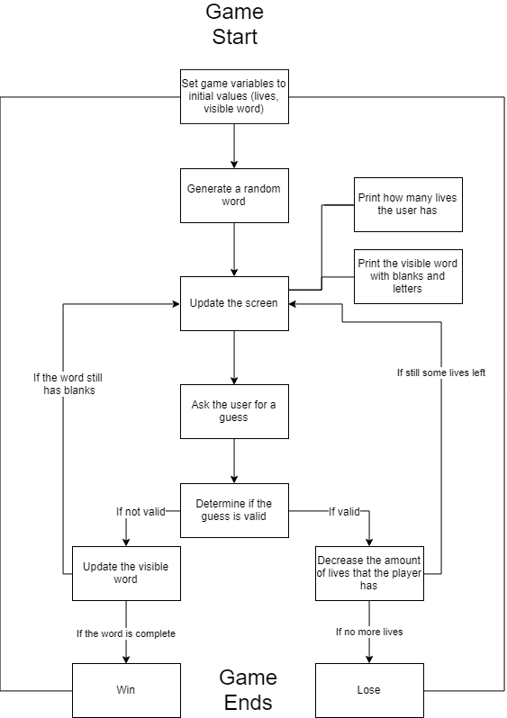

# Flowchart



# Background Information

  * In my program, I stored the random word as an array of letters. Each letter is simply a string with a length of 1 (ex. "A", "i").
  * I suggest using ```random.choice```.

# Step-by-step

### What variables do we need to make?
	* An array to hold our random word
	* An array of letters to hold the visible word - the one with blanks and guessed letters
	* A string to hold the letter that the user has guessed
	* An array of previous guessed letters (so that the user cannot guess the same letter twice)

### What additional modules do we need to use?
	* ```random``` - We need to use this built-in module so that we can choose a random word from our vocabulary

### What functions do we need to make?
	* ```getrandomword``` - grabs a random word from our vocabulary
	* ```play``` - this function will start the game cycle

### More suggestions

My code contained:
	* 2 ```while``` loops
	* 1 ```for``` loop
	* 2 ```if``` statements

Your code might not use the same number of these components, so these numbers are just guidelines!

You should try to program this now! If you get stuck for more than 10mins then you can move on to the next page where there is more hints. Don't give up!